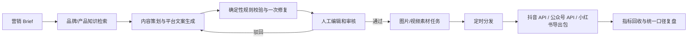

# ContentFlow

ContentFlow 是一套可部署的 AI 内容营销自动化系统，覆盖“内容策划 → 生产 → 审核 → 分发 → 数据复盘”主链路。项目包含 FastAPI 服务、持久化任务队列、RAG/pgvector、模型与平台适配层、对象存储、权限与审计、运营工作台、数据库迁移、Docker Compose 和自动化测试。

默认配置完全离线：文本、图片与视频任务使用明确标注的 Mock Provider，不调用付费模型，也不会冒充真实发布。配置百炼和平台授权后，同一套工作流可以切换到真实模型、抖音发布和公众号草稿/发布能力；小红书保持审核后导出模式。

## 完整业务流程



所有长任务均进入数据库任务队列。任务带幂等键、租约、重试次数和指数退避；内容版本发生变化后，旧素材会标为 `stale`，必须重新审核和生成，发布 Worker 还会再次校验内容版本与素材状态。

## 能力清单

- 多租户账户、工作区创建/切换、成员管理与 RBAC：`viewer / editor / reviewer / admin`
- PBKDF2 密码哈希、HMAC 签名访问令牌、Fernet 平台凭据加密
- 活动 Brief、运行批次、内容版本、平台结构化排版/分镜、素材、渠道、发布、指标和审计持久化
- Markdown/TXT/CSV/JSON 知识导入、切块、引用追踪
- 离线 Hash Embedding；生产环境支持 OpenAI 兼容/百炼 Embedding
- PostgreSQL + pgvector 1024 维向量列和 HNSW 余弦索引
- Mock/OpenAI 兼容/百炼文本生成
- Mock/Wan 图片与异步视频生成，生成结果写入本地存储或 S3/MinIO
- 人工审核门禁、内容版本校验、旧素材失效
- 小红书卡片结构、抖音逐镜头脚本和公众号章节结构随版本保存并进入投放链路
- 抖音视频上传/创建/数据回收适配器
- 公众号封面素材、草稿创建和可选发布提交适配器
- 小红书审核后 ZIP 投放包，不虚构公开发布能力
- 10 个业务区的响应式运营工作台，包含全量内容/版本回看、人工指标录入、团队权限与审计查询
- Alembic、Docker Compose、健康检查与结构化请求日志

## 目录

```text
contentflow/        后端领域模型、API、Worker、模型与平台适配器
migrations/         Alembic 初始生产迁移（含 pgvector/HNSW）
tests/              单元、接口、迁移、连接器契约和完整链路测试
web/                Next.js / vinext 运营工作台
docs/               架构、部署、平台边界和能力说明
docker-compose.yml  PostgreSQL、MinIO、API、Worker、Web
```

## 本地开发（SQLite）

环境要求：Python 3.11+、Node.js 22.13+。

```powershell
Copy-Item .env.example .env
python -m pip install -e ".[test]"
python -m alembic upgrade head
python -m uvicorn contentflow.api:app --reload
```

新开一个终端启动 Worker：

```powershell
contentflow-worker
```

再启动前端：

```powershell
Set-Location web
npm ci
npm run dev
```

访问：

- 工作台：`http://localhost:3000`（若端口被占用，可在 `.env` 中同时设置 `CONTENTFLOW_WEB_PORT=3300`，默认 CORS 已允许该备用端口）
- API 文档：`http://localhost:8000/docs`
- 健康检查：`http://localhost:8000/health/ready`

首次使用在登录页切换到“注册”，创建账户与工作区。默认 API 地址为 `http://localhost:8000/api/v1`。

## 一键容器部署

复制 `.env.example` 为 `.env`，至少设置强随机 `CONTENTFLOW_SECRET_KEY`、数据库密码和 MinIO 密码，然后执行：

```powershell
docker compose up --build
```

Compose 会启动：

- `postgres`：PostgreSQL 16 + pgvector
- `minio` / `minio-init`：私有对象存储与 bucket 初始化
- `api`：先执行 Alembic，再启动 FastAPI
- `worker`：消费持久化任务队列
- `web`：Next.js standalone 运营工作台

生产域名部署时，用 `NEXT_PUBLIC_CONTENTFLOW_API_BASE=https://api.example.com/api/v1` 作为 Web 构建参数，并以 JSON 数组设置跨域来源，例如 `CONTENTFLOW_CORS_ORIGINS=["https://content.example.com"]`。

## 切换百炼

```dotenv
CONTENTFLOW_TEXT_PROVIDER=dashscope
CONTENTFLOW_EMBEDDING_PROVIDER=dashscope
CONTENTFLOW_IMAGE_PROVIDER=dashscope
CONTENTFLOW_VIDEO_PROVIDER=dashscope
CONTENTFLOW_DASHSCOPE_API_KEY=...
CONTENTFLOW_DASHSCOPE_WORKSPACE_ID=...
CONTENTFLOW_DASHSCOPE_REGION=beijing
```

文本与 Embedding 使用百炼 OpenAI 兼容接口；图片调用 Wan 多模态生成接口；视频调用异步视频生成接口并由 Worker 轮询。百炼不同地域的 API Key、Workspace 和 Endpoint 不能混用，详见[阿里云百炼文档](https://help.aliyun.com/zh/model-studio/what-is-model-studio)。

## 平台连接边界

- 抖音：需要开放平台应用、用户 OAuth、`access_token` 和 `open_id`，能力还受应用 scope 与平台审核状态限制。适配器按“上传视频 → 创建作品 → 拉取视频数据”拆分。
- 公众号：需要有对应接口权限的 App ID/Secret。默认只创建草稿；只有渠道配置显式设置 `auto_publish=true` 才提交发布。
- 小红书：不采集账号密码、不报告虚假发布成功；系统将已审核文案、manifest 和素材打包成 ZIP，由运营人员人工投放。

更详细的权限与验收说明见 [docs/platform_connectors.md](docs/platform_connectors.md)。

## 测试与验收

```powershell
python -m unittest discover -s tests -v

# 容器栈启动后，验证真实 PostgreSQL/pgvector/MinIO/Worker 闭环
python scripts/validate_stack.py --base-url http://localhost:8000

Set-Location web
npm run lint
npm run build
npm run build:sites
node --test tests/rendered-html.test.mjs
```

自动化测试包含：

- 鉴权签名篡改、凭据加密和密码校验
- API 多租户活动/任务流程
- 工作区切换、成员增删改角色、最后管理员保护和审计查询
- Alembic upgrade/downgrade
- 抖音、公众号连接器 HTTP 契约
- 知识索引 → 内容生成 → 人工审核 → 素材生成 → 小红书 ZIP 导出的端到端链路
- Next.js 和 Sites 两套生产构建与服务端渲染烟测

真实外部账号的最终发布仍必须在具备相应授权和 scope 的测试账号中验收；仓库不会把 Mock 响应写成“外部平台已成功发布”。

## 文档

- [系统架构](docs/architecture.md)
- [生产部署与运维](docs/operations.md)
- [系统使用手册](docs/user_manual.md)
- [平台连接器与权限边界](docs/platform_connectors.md)
- [系统能力概览](docs/capability_overview.md)
- [生产化验收清单](docs/production_requirements.md)
