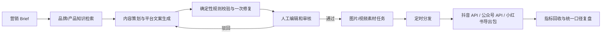

# ContentFlow

ContentFlow 是一套可部署的 AI 内容营销自动化系统，覆盖“内容策划 → 生产 → 审核 → 分发 → 数据复盘”主链路。项目包含 FastAPI 服务、持久化任务队列、RAG/pgvector、模型与平台适配层、对象存储、权限与审计、运营工作台、数据库迁移、Docker Compose 和自动化测试。

默认配置完全离线：文本、图片与视频任务使用明确标注的 Mock Provider，不调用付费模型，也不会冒充真实发布。配置百炼和平台授权后，同一套工作流可以切换到真实模型、抖音发布和公众号草稿/发布能力；小红书保持审核后导出模式。

## 完整业务流程



所有长任务均进入数据库任务队列。任务带幂等键、租约、重试次数和指数退避；内容版本发生变化后，旧素材会标为 `stale`，必须重新审核和生成，发布 Worker 还会再次校验内容版本与素材状态。公众号提交发布后会按 `publish_id` 自动对账，只有取得最终 `article_id` 才记为已发布。

## 能力清单

- 多租户账户、工作区创建/切换、成员管理与 RBAC：`viewer / editor / reviewer / admin`
- PBKDF2 密码哈希、HMAC 签名访问令牌、Fernet 平台凭据加密
- 活动 Brief、运行批次、内容版本、平台结构化排版/分镜、素材、渠道、发布、指标和审计持久化
- Markdown/TXT/CSV/JSON 知识导入、切块、引用追踪
- 离线 Hash Embedding；生产环境支持 OpenAI 兼容/百炼 Embedding
- PostgreSQL + pgvector 1024 维向量列和 HNSW 余弦索引
- Mock/OpenAI 兼容/百炼文本生成
- 每次文本生成记录 Provider、模型、Prompt 来源/发布版本、Prompt/输入/输出摘要、分阶段时延和 Provider 返回的 Token 用量；不在运行追溯中复制原始 Prompt，也不虚构 Token 或成本
- 工作区 Prompt Registry：不可变草稿、另一名管理员审批/拒绝、激活与历史回滚；激活和运行前校验正文 SHA-256，审计只保存版本与哈希
- 版本化 Prompt Eval：不可变确定性用例、双人激活、异步 Worker 执行、Prompt/套件/目标 Provider 与模型绑定；当前套件未通过时审批、激活、回滚和每次实际生成均失败关闭
- Mock/Wan 图片与异步视频生成，生成结果写入本地存储或 S3/MinIO
- 人工审核门禁、内容版本校验、旧素材失效
- 小红书卡片结构、抖音逐镜头脚本和公众号章节结构随版本保存并进入投放链路
- 抖音视频上传/创建/数据回收适配器
- 公众号封面素材、草稿创建、可选发布提交和基于 `publish_id` 的最终状态对账适配器
- 小红书审核后 ZIP 投放包，不虚构公开发布能力
- 10 个业务区的响应式运营工作台，包含全量内容/版本回看、人工指标录入、团队权限、Prompt/Eval 治理与审计查询
- Alembic、Docker Compose、健康检查与结构化请求日志

## 目录

```text
contentflow/        后端领域模型、API、Worker、模型与平台适配器
migrations/         Alembic 初始生产迁移（含 pgvector/HNSW）
tests/              单元、接口、迁移、连接器契约和完整链路测试
web/                Next.js / vinext 运营工作台
docs/               架构、部署、平台边界和能力说明
docker-compose.yml  PostgreSQL、MinIO、API、Worker、Web
```

## 本地开发（PostgreSQL）

环境要求：Python 3.11+、Node.js 22.13+、Docker Desktop。SQLite 只用于显式指定数据库 URL 的隔离测试，不再是默认运行数据库。

```powershell
Copy-Item .env.example .env
# 将 .env 中所有 replace-me 替换为本机开发凭据。
docker compose up -d postgres

python -m venv .venv
.\.venv\Scripts\python.exe -m pip install -e ".[test,security]"
.\.venv\Scripts\python.exe -m contentflow.migrate
.\.venv\Scripts\python.exe -m uvicorn contentflow.api:app --reload
```

已有 PostgreSQL volume 的密码由首次初始化决定；修改 `.env` 不会自动修改旧 volume 中的密码。不要用 `docker compose down -v` 处理密码不一致，除非已完成备份并明确要删除全部数据。

开发环境启动 API 或 Worker 时也会自动执行安全的增量迁移。对于早期
`create_all` 创建、尚未写入 Alembic 版本号的本地数据库，迁移器会先核对
完整表结构，再补齐版本记录和新增字段；检测到缺表或半迁移状态时会停止并
提示先备份，避免静默破坏数据。

新开一个终端启动 Worker：

```powershell
contentflow-worker
```

再启动前端：

```powershell
Set-Location web
npm ci
npm run dev:local
```

访问：

- 工作台：`http://localhost:3001`（专用本地开发端口，避免与其他常见的 `3000` 端口项目冲突）
- API 文档：`http://localhost:8000/docs`
- 健康检查：`http://localhost:8000/health/ready`

首次使用在登录页切换到“注册”，创建账户与工作区。默认 API 地址为 `http://localhost:8000/api/v1`。

## 一键容器部署

复制 `.env.example` 为 `.env`，至少设置两个不同的 32 位以上随机密钥 `CONTENTFLOW_SECRET_KEY`、`CONTENTFLOW_CREDENTIAL_ENCRYPTION_KEY`，并替换 PostgreSQL 与 MinIO 密码。离线验收可保留 `CONTENTFLOW_ALLOW_MOCK_PROVIDERS=true`；真实生产必须设为 `false` 并配置真实 Provider。

```powershell
docker compose config
docker compose up --build -d
docker compose ps
```

Compose 会启动：

- `postgres`：PostgreSQL 16 + pgvector
- `minio` / `minio-init`：私有对象存储与 bucket 初始化
- `api`：先执行 Alembic，再启动 FastAPI
- `worker`：消费持久化任务队列
- `web`：Next.js standalone 运营工作台


生产环境默认关闭公开注册。首次管理员账户应通过受控初始化窗口创建，完成后设置 `CONTENTFLOW_ALLOW_REGISTRATION=false`。生产启动校验会拒绝 SQLite、local 对象存储、通配 CORS、复用应用签名密钥加密凭据，以及未显式许可的 Mock/Hash Provider。
生产域名部署时，用 `NEXT_PUBLIC_CONTENTFLOW_API_BASE=https://api.example.com/api/v1` 作为 Web 构建参数，并以 JSON 数组设置跨域来源，例如 `CONTENTFLOW_CORS_ORIGINS=["https://content.example.com"]`。

浏览器会话默认使用 15 分钟访问令牌和 14 天旋转刷新令牌；二者只通过 `HttpOnly`、`SameSite=Lax` Cookie 传输，生产环境自动启用 `Secure`，前端不再保存 Bearer Token。Web 与 API 应部署在同一站点的 HTTPS 域名下；`CONTENTFLOW_AUTH_COOKIE_DOMAIN` 默认留空以使用范围最小的 host-only Cookie。生产构建会把 API Origin 固定为 `NEXT_PUBLIC_CONTENTFLOW_API_BASE` 并生成 CSP；只有 HTTPS API 构建才启用 HSTS 与请求升级。本地开发仍可修改 API 地址。登录、注册和刷新由 PostgreSQL 共享限流保护，限流键不保存邮箱/IP 明文；只有经过明确信任的反向代理才配置 `CONTENTFLOW_TRUSTED_PROXY_HOPS`。脚本和受控 CLI 仍可使用登录响应中的短期 Bearer Token。

## 切换百炼

```dotenv
CONTENTFLOW_TEXT_PROVIDER=dashscope
CONTENTFLOW_EMBEDDING_PROVIDER=dashscope
CONTENTFLOW_IMAGE_PROVIDER=dashscope
CONTENTFLOW_VIDEO_PROVIDER=dashscope
CONTENTFLOW_DASHSCOPE_API_KEY=...
CONTENTFLOW_DASHSCOPE_WORKSPACE_ID=...
CONTENTFLOW_DASHSCOPE_REGION=beijing
```

文本与 Embedding 使用百炼 OpenAI 兼容接口；图片调用 Wan 多模态生成接口；视频调用异步视频生成接口并由 Worker 轮询。百炼不同地域的 API Key、Workspace 和 Endpoint 不能混用，详见[阿里云百炼文档](https://help.aliyun.com/zh/model-studio/what-is-model-studio)。

## 平台连接边界

- 抖音：需要开放平台应用、用户 OAuth、`access_token` 和 `open_id`，能力还受应用 scope 与平台审核状态限制。适配器按“上传视频 → 创建作品 → 拉取视频数据”拆分。
- 公众号：需要有对应接口权限的 App ID/Secret。默认只创建草稿；只有渠道配置显式设置 `auto_publish=true` 才提交发布。
- 小红书：不采集账号密码、不报告虚假发布成功；系统将已审核文案、manifest 和素材打包成 ZIP，由运营人员人工投放。

更详细的权限与验收说明见 [docs/platform_connectors.md](docs/platform_connectors.md)。

## 测试与验收

推荐按已记录的锁文件重建 Python 环境：

```powershell
uv sync --all-extras --locked --python 3.12
uv run --locked ruff check .
uv run --locked pytest -q --cov=contentflow --cov-branch --cov-fail-under=75
$env:PYTHONUTF8="1"
uv run --locked pip-audit --strict
```

不使用 uv 时仍可在现有虚拟环境中运行：

```powershell
.\.venv\Scripts\python.exe -m ruff check contentflow tests scripts
.\.venv\Scripts\python.exe -m pytest -q
.\.venv\Scripts\python.exe -m pip check
$env:PYTHONUTF8="1"
.\.venv\Scripts\python.exe -m pip_audit

# 容器栈启动后，验证真实 PostgreSQL/pgvector/MinIO/Worker 闭环
.\.venv\Scripts\python.exe scripts\validate_stack.py --base-url http://localhost:8000

Set-Location web
npm run lint
npm run build
npm test
npm audit --audit-level=moderate
```

`tests/test_postgres_integration.py` 默认在未配置数据库时跳过。CI 会启动固定 digest 的 PostgreSQL/pgvector，并通过 `CONTENTFLOW_TEST_POSTGRES_URL` 在随机临时数据库中强制执行迁移、`SKIP LOCKED`、幂等重排和竞态测试；测试结束会终止残留连接并精确删除临时数据库。

`tests/test_minio_integration.py` 默认在未配置测试 S3 凭据时跳过。CI 使用固定 digest 的无持久卷 MinIO，在随机 bucket 中验证 SHA-256 元数据、上传/读取、bucket 边界、大小限制、篡改检测和旧对象兼容；测试完成后清空并删除随机 bucket，再停止临时容器。

自动化测试包含：

- 鉴权签名篡改、凭据加密和密码校验
- API 多租户活动/任务流程
- 工作区切换、成员增删改角色、最后管理员保护和审计查询
- Prompt 不可变版本、双人审批、拒绝、激活、回滚、租户隔离、运行时溯源与篡改阻断
- Alembic upgrade/downgrade
- 抖音、公众号连接器 HTTP 契约，以及公众号 pending/最终 article_id 状态查询
- 自动发布对账、人工接管、迟到结果隔离和 PostgreSQL `SKIP LOCKED` 幂等补偿
- 知识索引 → 内容生成 → 人工审核 → 素材生成 → 小红书 ZIP 导出的端到端链路
- Next.js 和 Sites 两套生产构建与服务端渲染烟测


## 备份与隔离恢复校验

```powershell
# 生成 PostgreSQL custom dump、MinIO 对象镜像和逐对象 SHA-256 manifest v2
.\scripts\backup_stack.ps1

# 恢复到随机临时数据库和随机临时 bucket，核对后自动清理
.\scripts\verify_backup.ps1 -BackupPath .\.contentflow\backups\<timestamp>

# 仅验证历史回滚包时，显式声明它对应的数据库版本和表数门槛
.\scripts\verify_backup.ps1 -BackupPath <path> -ExpectedAlembicRevision <revision> -MinimumPublicTableCount <count>
```

默认备份会拒绝 API/Worker 仍在写入或数据库不在当前 Alembic head 的情况，并用 `.incomplete` 标记未完成目录；不要用 `-AllowLiveWrites` 生成正式恢复点。

恢复校验不会修改正在运行的 `contentflow` 数据库。它会核对 dump、清单、逐对象大小与哈希，并把数据库和对象分别恢复到随机临时资源后再次校验。真正的灾难恢复会覆盖目标环境，必须先在隔离环境完成校验并按 [生产部署与运维](docs/operations.md) 的停机、密钥和对象存储步骤执行。

真实外部账号的最终发布仍必须在具备相应授权和 scope 的测试账号中验收；仓库不会把 Mock 响应写成“外部平台已成功发布”。

## 文档

- [系统架构](docs/architecture.md)
- [生产部署与运维](docs/operations.md)
- [系统使用手册](docs/user_manual.md)
- [平台连接器与权限边界](docs/platform_connectors.md)
- [系统能力概览](docs/capability_overview.md)
- [生产化验收清单](docs/production_requirements.md)
- [外部服务真实验收记录](docs/external_acceptance.md)
