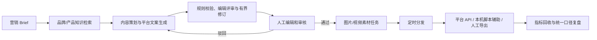

# ContentFlow

ContentFlow 是一套可部署的 AI 内容营销自动化系统，覆盖“内容策划 → 生产 → 审核 → 分发 → 数据复盘”主链路。项目包含 FastAPI 服务、持久化任务队列、RAG/pgvector、模型与平台适配层、对象存储、权限与审计、运营工作台、数据库迁移、Docker Compose 和自动化测试。

默认配置完全离线：文本、图片与视频任务使用明确标注的 Mock Provider，不调用付费模型，也不会冒充真实发布。配置中立的模型/媒体 Provider 和平台授权后，同一套工作流可以切换到真实模型和经授权的平台 API；各平台也可显式选择不保存账号密码、最终提交由人工完成的本机脚本辅助模式，小红书另保留审核后人工导出。

## 完整业务流程



所有长任务均进入数据库任务队列。任务带幂等键、租约、重试次数和指数退避；内容版本发生变化后，旧素材会标为 `stale`，必须重新审核和生成，发布 Worker 还会再次校验内容版本与素材状态。公众号提交发布后会按 `publish_id` 自动对账，只有取得最终 `article_id` 才记为已发布。

## 能力清单

- 多租户账户、工作区创建/切换、成员管理与 RBAC：`viewer / editor / reviewer / admin`
- PBKDF2 密码哈希、HMAC 签名访问令牌、Fernet 平台凭据加密
- 活动 Brief、运行批次、内容版本、平台结构化排版/分镜、素材、渠道、发布、指标和审计持久化；审计记录按工作区形成可核验 SHA-256 哈希链
- Markdown/TXT/CSV/JSON 知识导入、切块、引用追踪
- 离线 Hash Embedding；生产可显式选择 OpenAI-compatible Embedding 或固定版本的本地 BGE-M3（1024 维归一化 Dense 向量）
- PostgreSQL + pgvector 1024 维向量列和 HNSW 余弦索引
- Mock/OpenAI-compatible 文本生成
- 有界内容工作室 Agent：策略候选、证据账本、平台化草稿、九维编辑评审、最多一次定向修订与回归保护
- 可安装的声明式风格 Skill：工作区隔离、语义化版本、内容哈希和启停审计，不执行用户代码
- 每次文本生成记录 Provider、模型、Prompt 来源/发布版本、Prompt/输入/输出摘要、分阶段时延和 Provider 返回的 Token 用量；不在运行追溯中复制原始 Prompt，也不虚构 Token 或成本
- 工作区 Prompt Registry：不可变草稿、另一名管理员审批/拒绝、激活与历史回滚；激活和运行前校验正文 SHA-256，审计只保存版本与哈希
- 版本化 Prompt Eval：不可变确定性用例、双人激活、异步 Worker 执行、Prompt/套件/目标 Provider 与模型绑定；当前套件未通过时审批、激活、回滚和每次实际生成均失败关闭
- Mock/中立 HTTP 图片与异步视频生成，以及人工上传真实素材模式；结果写入本地存储或 S3/MinIO
- 统一工作区对象账本、并发容量预留、可重试删除、周期只读核对和存储完整性告警；孤儿删除始终要求管理员确认
- 人工、AI 生成、开放授权搜索和混合候选四种图片来源；搜索候选保留作者/许可/原始页面并要求人工核验
- 人工审核门禁、内容版本校验、旧素材失效
- 小红书卡片结构、抖音逐镜头脚本和公众号章节结构随版本保存并进入投放链路
- 抖音视频上传/创建/数据回收适配器
- 公众号封面素材、草稿创建、可选发布提交和基于 `publish_id` 的最终状态对账适配器
- 官方 API、本机脚本辅助和小红书人工导出三种显式发布方式；不确定 API 结果必须先对账，禁止静默脚本降级
- 10 个业务区的响应式运营工作台，包含全量内容/版本回看、人工指标录入、团队权限、Prompt/Eval 治理、审计查询与完整性告警
- Alembic、Docker Compose、健康检查、结构化日志、受保护 Prometheus 指标、版本化告警规则与 Grafana 运维看板

## 目录

```text
contentflow/        后端领域模型、API、Worker、模型与平台适配器
migrations/         Alembic 初始生产迁移（含 pgvector/HNSW）
tests/              单元、接口、迁移、连接器契约和完整链路测试
web/                Next.js / vinext 运营工作台
docs/               架构、部署、平台边界和能力说明
docker-compose.yml  PostgreSQL、MinIO、API、Worker、Web
```

## 本地开发（PostgreSQL）

环境要求：Python 3.11+、Node.js 22.13+、Docker Desktop。SQLite 只用于显式指定数据库 URL 的隔离测试，不再是默认运行数据库。

```powershell
Copy-Item .env.example .env
# 将 .env 中所有 replace-me 替换为本机开发凭据。
docker compose up -d postgres

python -m venv .venv
.\.venv\Scripts\python.exe -m pip install -e ".[test,security]"
.\.venv\Scripts\python.exe -m contentflow.migrate
.\.venv\Scripts\python.exe -m uvicorn contentflow.api:app --reload
```

已有 PostgreSQL volume 的密码由首次初始化决定；修改 `.env` 不会自动修改旧 volume 中的密码。不要用 `docker compose down -v` 处理密码不一致，除非已完成备份并明确要删除全部数据。

开发环境启动 API 或 Worker 时也会自动执行安全的增量迁移。对于早期
`create_all` 创建、尚未写入 Alembic 版本号的本地数据库，迁移器会先核对
完整表结构，再补齐版本记录和新增字段；检测到缺表或半迁移状态时会停止并
提示先备份，避免静默破坏数据。

新开一个终端启动 Worker：

```powershell
contentflow-worker
```

再启动前端：

```powershell
Set-Location web
npm ci
npm run dev:local
```

访问：

- 工作台：`http://localhost:3001`（专用本地开发端口，避免与其他常见的 `3000` 端口项目冲突）
- API 文档：`http://localhost:8000/docs`
- 健康检查：`http://localhost:8000/health/ready`
- Prometheus 指标：`http://localhost:8000/metrics`（仅在显式启用并携带独立 Bearer Token 时可用）
- Grafana 运维看板：`http://127.0.0.1:3301`（仅启动 `observability` profile 后可用）

首次使用在登录页切换到“注册”，创建账户与工作区。默认 API 地址为 `http://localhost:8000/api/v1`。

面向工作区的可增长列表均默认每页 100 条，使用 `limit`（最大 200；运行记录保持最大 100）与不透明 `cursor` 继续读取；范围包括活动、运行、内容、素材、渠道、发布任务、知识文档、队列任务、工作区、成员、风格 Skill、内容修订、发布证据/确认、审计和 Prompt/Eval 历史。响应头 `X-ContentFlow-Next-Cursor` 表示还有下一页。运营增量接口的 `updated_after` 只接受带时区时间，`X-ContentFlow-Sync-Time` 提供服务端同步水位；按版本号或审计序号排序的历史使用独立序列游标。数组响应结构保持不变，跨域 Web 可读取这些分页头。Prompt/Eval 管理摘要只返回最近 100 条嵌套记录，完整历史由对应分页端点提供。

## 一键容器部署

复制 `.env.example` 为 `.env`，至少设置两个不同的 32 位以上随机密钥 `CONTENTFLOW_SECRET_KEY`、`CONTENTFLOW_CREDENTIAL_ENCRYPTION_KEY`，并替换 PostgreSQL 与 MinIO 密码。离线验收可保留 `CONTENTFLOW_ALLOW_MOCK_PROVIDERS=true`；真实生产必须设为 `false` 并配置真实 Provider。生产还必须显式设置 `CONTENTFLOW_REQUIRE_GOVERNED_PROMPTS=true` 和 `CONTENTFLOW_METRICS_ENABLED=true`；Compose 的 API/Worker 默认启用 Prompt 门禁。指标端点必须使用与应用签名/凭据密钥不同的 32 位以上 Bearer Token，并只允许内部监控网络访问。

首次生产初始化时保持门禁开启，只临时允许受限来源注册两个管理员：一人创建并激活工作区，另一人加入该工作区成为管理员；随后依次完成 Eval 套件双人激活、Prompt 评测、双人审批与激活。管理页显示“可生成”后立刻设置 `CONTENTFLOW_ALLOW_REGISTRATION=false` 并重新部署。初始化期间未完成治理的生成请求会在入队前返回 409，不应通过临时关闭治理门禁绕过。

```powershell
docker compose config
docker compose up --build -d
docker compose ps
```

Compose 会启动：

- `postgres`：PostgreSQL 16 + pgvector
- `minio` / `minio-init`：私有对象存储与 bucket 初始化
- `api`：先执行 Alembic，再启动 FastAPI
- `worker`：消费持久化任务队列
- `web`：Next.js standalone 运营工作台
- `prometheus` / `grafana`：可选 `observability` profile，加载版本化抓取、记录/告警规则和只读运维看板

启用监控 profile 前，设置独立的 32 位以上指标 Token 与 Grafana 管理员密码；两者不能相同。Prometheus 不映射宿主端口，Grafana 默认只绑定 `127.0.0.1:3301`：

```powershell
docker compose --profile observability up --build -d
```

完整安全边界、规则校验和生产剩余项见 `deploy/observability/README.md`。


生产环境默认关闭公开注册。首次管理员账户应通过受控初始化窗口创建，完成后设置 `CONTENTFLOW_ALLOW_REGISTRATION=false`。生产启动校验会拒绝 SQLite、local 对象存储、通配 CORS、复用应用签名密钥加密凭据，以及未显式许可的 Mock/Hash Provider。
生产域名部署时，用 `NEXT_PUBLIC_CONTENTFLOW_API_BASE=https://api.example.com/api/v1` 作为 Web 构建参数，并以 JSON 数组设置跨域来源，例如 `CONTENTFLOW_CORS_ORIGINS=["https://content.example.com"]`。

浏览器会话默认使用 15 分钟访问令牌和 14 天旋转刷新令牌；二者只通过 `HttpOnly`、`SameSite=Lax` Cookie 传输，生产环境自动启用 `Secure`，前端不再保存 Bearer Token。Web 与 API 应部署在同一站点的 HTTPS 域名下；`CONTENTFLOW_AUTH_COOKIE_DOMAIN` 默认留空以使用范围最小的 host-only Cookie。生产构建会把 API Origin 固定为 `NEXT_PUBLIC_CONTENTFLOW_API_BASE` 并生成 CSP；只有 HTTPS API 构建才启用 HSTS 与请求升级。本地开发仍可修改 API 地址。登录、注册和刷新由 PostgreSQL 共享限流保护，限流键不保存邮箱/IP 明文；只有经过明确信任的反向代理才配置 `CONTENTFLOW_TRUSTED_PROXY_HOPS`。脚本和受控 CLI 仍可使用登录响应中的短期 Bearer Token。

## 配置真实 AI Provider

文本与 Embedding 可以使用显式配置的 OpenAI-compatible 端点，不预设云厂商或模型。两者可继续共用 `MODEL_API_*`，也可让 Embedding 使用独立端点：

```dotenv
CONTENTFLOW_TEXT_PROVIDER=openai-compatible
CONTENTFLOW_EMBEDDING_PROVIDER=openai-compatible
CONTENTFLOW_MODEL_API_BASE=https://models.example.com/v1
CONTENTFLOW_MODEL_API_KEY=...
CONTENTFLOW_TEXT_MODEL=configured-text-model
CONTENTFLOW_MODEL_REQUEST_TIMEOUT_SECONDS=120
CONTENTFLOW_EMBEDDING_API_BASE=https://embeddings.example.com/v1
CONTENTFLOW_EMBEDDING_API_KEY=...
CONTENTFLOW_EMBEDDING_MODEL=configured-embedding-model
```

Embedding 也可独立使用本地 BGE-M3。模型提交必须固定，默认在 Worker 首次检索/索引时懒加载，知识分块按可配置批次推理，后续由进程缓存复用；容器使用 CPU-only PyTorch 和持久模型缓存卷：

```dotenv
CONTENTFLOW_EMBEDDING_PROVIDER=bge-m3-local
CONTENTFLOW_LOCAL_EMBEDDING_MODEL=BAAI/bge-m3
CONTENTFLOW_LOCAL_EMBEDDING_REVISION=5617a9f61b028005a4858fdac845db406aefb181
CONTENTFLOW_LOCAL_EMBEDDING_DEVICE=cpu
CONTENTFLOW_LOCAL_EMBEDDING_OFFLINE=false
CONTENTFLOW_LOCAL_EMBEDDING_BATCH_SIZE=8
```

文本请求默认超时 120 秒，可在 10–300 秒内调整。长文 Agent 会显著增加请求时长和 Token 用量；超时配置是单次请求上限，不会放开修订轮数。可选修订的生成或最终复评失败时，系统保留已经完成编辑/安全评审的原稿并记录失败类型，绝不会采用未经最终复评的修订稿。

开放授权图片搜索默认使用 Openverse 的 Wikimedia 来源，只保留 CC0/PDM/BY/BY-SA 和精确允许的下载域名。页面要求用户打开原始页面核验许可后才能选择；许可元数据是检索线索，不是法律保证：

```dotenv
CONTENTFLOW_IMAGE_SEARCH_PROVIDER=openverse
CONTENTFLOW_OPENVERSE_API_BASE=https://api.openverse.org/v1
CONTENTFLOW_IMAGE_SEARCH_RESULT_LIMIT=6
CONTENTFLOW_IMAGE_SEARCH_DOWNLOAD_ALLOWED_HOSTS=["upload.wikimedia.org"]
```

没有可验收的媒体生成服务时，可以显式使用人工真实素材模式。审核通过后素材进入 `awaiting_upload`，上传并绑定当前内容版本且安全解码成功后才变为 `ready`；发布门禁不会把“等待人工封面”误报为生成成功：

```dotenv
CONTENTFLOW_IMAGE_PROVIDER=manual
CONTENTFLOW_VIDEO_PROVIDER=manual
```

图片与视频也可使用 ContentFlow 定义的中立 HTTP 媒体契约；部署方可以连接内部模型网关或独立适配服务：

```dotenv
CONTENTFLOW_IMAGE_PROVIDER=http
CONTENTFLOW_VIDEO_PROVIDER=http
CONTENTFLOW_MEDIA_API_BASE=https://media.example.com/v1
CONTENTFLOW_MEDIA_API_KEY=...
CONTENTFLOW_MEDIA_DOWNLOAD_ALLOWED_HOSTS=["assets.example.com"]
CONTENTFLOW_IMAGE_MODEL=configured-image-model
CONTENTFLOW_VIDEO_MODEL=configured-video-model
```

HTTP 媒体契约使用 `POST /images/generations`、`POST /videos/generations` 和 `GET /videos/generations/{task_id}`；图片可返回受限 base64 或下载 URL，视频可同步完成或返回任务 ID 后由 Worker 轮询。生产启动会拒绝缺少端点、密钥、模型名或精确下载域名允许列表的真实 Provider 配置；下载器会在发出每一跳请求前校验非空精确域名 allowlist，生产仅允许默认 HTTPS 端口；Provider JSON 响应默认硬限制为 32 MiB，较大素材必须使用受控下载 URL。

v1 的机器可读定义见 [OpenAPI](docs/contracts/contentflow-media-v1.openapi.yml)，强制语义和对接边界见 [媒体 Provider 契约](docs/media_provider_contract.md)。生成请求携带协议版本和稳定、不透明的 `Idempotency-Key`；Worker 会区分永久协议错误与可重试的超时、限流和服务端错误，并在 `429` 等场景遵守有界 `Retry-After`。数据库内部元数据只按白名单转换为媒体参数，不会原样透传。

目标媒体服务上线前，应把上述 `CONTENTFLOW_*` 配置注入当前 shell，并运行一次可能计费的受控验收：

```powershell
$contentFlowEvidenceStamp = Get-Date -Format "yyyyMMdd-HHmmss"
uv run --locked contentflow-media-conformance --kind both --output ".contentflow/evidence/media-conformance-$contentFlowEvidenceStamp.json" --confirm-live-generation
```

runner 会在联网前独占预留新报告文件，并验证正常生成、同键重放/冲突、版本拒绝、鉴权拒绝和视频轮询；报告不保存密钥、端点、模型、Prompt、任务 ID、媒体 URL 或原始响应。它不能替代限流/超时/审核/下载过期注入、账单核对和人工质量验收。生产配置切换前必须排空在途媒体任务；旧异步任务的目标配置指纹与当前配置不一致时会失败关闭，避免误轮询新服务。
## 平台连接边界

- 抖音：需要开放平台应用、用户 OAuth、`access_token` 和 `open_id`，能力还受应用 scope 与平台审核状态限制。适配器按“上传视频 → 创建作品 → 拉取视频数据”拆分。
- 公众号：需要有对应接口权限的 App ID/Secret。默认只创建草稿；只有渠道配置显式设置 `auto_publish=true` 才提交发布。
- 小红书：不采集账号密码、不报告虚假发布成功；可使用人工导出，也可选择本机脚本辅助。
- 本机脚本辅助：生成带 SHA-256 清单、固定 Playwright 版本、审核文案和素材的 ZIP；运行器只打开内置官方入口并尽力填充，使用按平台/渠道隔离的本机浏览器登录目录，不读取平台密码，也不会点击最终发布按钮。完成后必须由 reviewer 在 ContentFlow 登记已发布或未发布。
- 脚本结果证据：确认前必须上传规范化 PNG/JPEG/WebP 截图或平台 JSON；证据、任务包和脚本尝试以 SHA-256 绑定。发起人不能确认自己的尝试；渠道可要求一名或两名独立 reviewer，一旦首次确认就冻结当前证据。
- 安全降级：只有尚未产生平台副作用的 `scheduled/queued/failed/exported` 任务可切脚本；`publishing/submitted/reconciliation_required` 必须先在平台人工对账，避免一篇内容被重复发布。

更详细的权限与验收说明见 [docs/platform_connectors.md](docs/platform_connectors.md)。

## 测试与验收

推荐按已记录的锁文件重建 Python 环境：

```powershell
uv sync --all-extras --locked --python 3.12
uv run --locked ruff check .
uv run --locked pytest -q --cov=contentflow --cov-branch --cov-fail-under=75
$env:PYTHONUTF8="1"
uv run --locked python scripts/supply_chain.py audit-python
```

不使用 uv 时仍可在现有虚拟环境中运行：

```powershell
.\.venv\Scripts\python.exe -m ruff check contentflow tests scripts
.\.venv\Scripts\python.exe -m pytest -q
.\.venv\Scripts\python.exe -m pip check
$env:PYTHONUTF8="1"
.\.venv\Scripts\python.exe -m pip_audit

# 容器栈启动后，验证真实 PostgreSQL/pgvector/MinIO/Worker 闭环
.\.venv\Scripts\python.exe scripts\validate_stack.py --base-url http://localhost:8000

Set-Location web
npm run lint
npm run build
npm test
npm audit --audit-level=moderate
```

`tests/test_postgres_integration.py` 默认在未配置数据库时跳过。CI 会启动固定 digest 的 PostgreSQL/pgvector，并通过 `CONTENTFLOW_TEST_POSTGRES_URL` 在随机临时数据库中强制执行迁移、`SKIP LOCKED`、幂等重排和竞态测试；测试结束会终止残留连接并精确删除临时数据库。

`tests/test_minio_integration.py` 默认在未配置测试 S3 凭据时跳过。CI 使用固定 digest 的无持久卷 MinIO，在随机 bucket 中验证 SHA-256 元数据、上传/读取、bucket 边界、大小限制、篡改检测和旧对象兼容；测试完成后清空并删除随机 bucket，再停止临时容器。

自动化测试包含：

- 鉴权签名篡改、凭据加密和密码校验
- API 多租户活动/任务流程
- 工作区切换、成员增删改角色、最后管理员保护和审计查询
- Prompt 不可变版本、双人审批、拒绝、激活、回滚、租户隔离、运行时溯源与篡改阻断
- Alembic upgrade/downgrade
- 抖音、公众号连接器 HTTP 契约，以及公众号 pending/最终 article_id 状态查询
- 自动发布对账、人工接管、迟到结果隔离和 PostgreSQL `SKIP LOCKED` 幂等补偿
- 知识索引 → 内容生成 → 人工审核 → 素材生成 → 小红书 ZIP 导出的端到端链路
- Next.js 和 Sites 两套生产构建与服务端渲染烟测


## 可验证的软件供应链材料

CI 会在只读权限 Job 中生成 Python 与前端 CycloneDX SBOM、只含 Git 跟踪文件的可复现源码归档和 `SHA256SUMS`，并在上传 Artifact 前离线验证组件/版本/依赖图、绝对路径泄漏、归档文件集和摘要。非 Pull Request 运行在后端、前端和供应链门禁全部通过后，使用隔离的 OIDC/attestation 权限发布 SLSA 来源证明和两份 CycloneDX SBOM 证明；所有 Action 固定到完整提交 SHA，checkout 不持久化令牌。

```powershell
gh attestation verify .\contentflow-source-<commit>.tar.gz --repo heee000/ContentFlow --signer-workflow heee000/ContentFlow/.github/workflows/ci.yml --source-digest <commit>
gh attestation verify .\contentflow-source-<commit>.tar.gz --repo heee000/ContentFlow --signer-workflow heee000/ContentFlow/.github/workflows/ci.yml --source-digest <commit> --predicate-type https://cyclonedx.org/bom
```

完整的本地生成、哈希核对、证明验证和边界说明见 [软件供应链证据](docs/supply_chain.md)。源码证明之外，受控公网工作流还会为 OCI 镜像生成 BuildKit provenance/SBOM、执行 Critical 漏洞门禁并记录不可变 digest；镜像签名、注册表保留和部署时密码学验签仍需后续生产签收。

## 受控公网测试

固定 IPv4 单机、Caddy 同源 HTTPS、GHCR 不可变镜像、R2 双 Bucket、本地 BGE 固定缓存、加密 PostgreSQL 备份和人工批准部署的完整入口见 [公网测试部署手册](deploy/public-test/README.md)。规划与成本依据见 [公网测试部署实现计划](docs/public_test_deployment_plan.md)。仓库资产可静态验证：

```powershell
uv run --locked python scripts/validate_public_test_deployment.py
```

这些资产不代表目标云环境已经上线；固定 IP、DNS、R2、真实模型、微信白名单、跨网络草稿和恢复演练仍必须取得真实证据。


## 备份与隔离恢复校验

```powershell
# 生成 PostgreSQL custom dump、MinIO 对象镜像和逐对象 SHA-256 manifest v2
.\scripts\backup_stack.ps1

# 恢复到随机临时数据库和随机临时 bucket，核对后自动清理
.\scripts\verify_backup.ps1 -BackupPath .\.contentflow\backups\<timestamp>

# 仅验证历史回滚包时，显式声明它对应的数据库版本和表数门槛
.\scripts\verify_backup.ps1 -BackupPath <path> -ExpectedAlembicRevision <revision> -MinimumPublicTableCount <count>
```

默认备份会拒绝 API/Worker 仍在写入或数据库不在当前 Alembic head 的情况，并用 `.incomplete` 标记未完成目录；不要用 `-AllowLiveWrites` 生成正式恢复点。

恢复校验不会修改正在运行的 `contentflow` 数据库。它会核对 dump、清单、逐对象大小与哈希，并把数据库和对象分别恢复到随机临时资源后再次校验。真正的灾难恢复会覆盖目标环境，必须先在隔离环境完成校验并按 [生产部署与运维](docs/operations.md) 的停机、密钥和对象存储步骤执行。

真实外部账号的最终发布仍必须在具备相应授权和 scope 的测试账号中验收；仓库不会把 Mock 响应写成“外部平台已成功发布”。

## 维护者与贡献者

- [John Wang (@heee000)](https://github.com/heee000) — 项目维护者与贡献者

## 文档

- [系统架构](docs/architecture.md)
- [生产部署与运维](docs/operations.md)
- [公网测试部署实现计划](docs/public_test_deployment_plan.md)
- [系统使用手册](docs/user_manual.md)
- [平台连接器与权限边界](docs/platform_connectors.md)
- [系统能力概览](docs/capability_overview.md)
- [生产化验收清单](docs/production_requirements.md)
- [外部服务真实验收记录](docs/external_acceptance.md)
- [工程变更台账](docs/engineering_change_log.md)
- [阶段性总结与分层完成度](docs/phase_summary_2026-08-22.md)
- [软件供应链证据与验签](docs/supply_chain.md)
- [Git 历史身份重写映射](docs/git_history_rewrite_20260812.md)
- [企业成熟度持续复审](docs/enterprise_readiness_review.md)
- [项目交接与现场规则](docs/CONTENTFLOW_HANDOFF.md)
