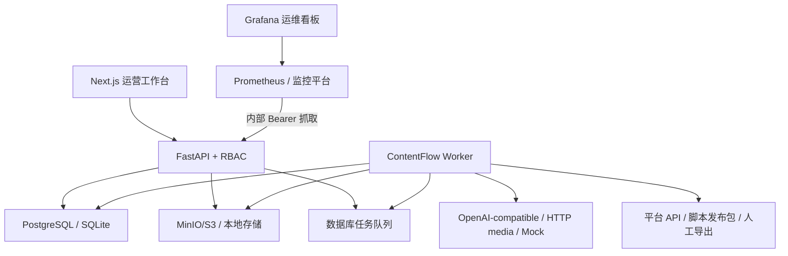

# ContentFlow 系统架构

## 1. 设计目标

内容营销同时包含概率性 AI 任务和确定性业务规则。ContentFlow 不使用一个 Agent 包办所有步骤，而是把系统拆成可观察、可重试、可替换的工作流节点。每个节点都有结构化输入输出，外部副作用只能发生在人工审核之后。

## 2. 领域模型

- `Workspace` 与 `Membership`：租户隔离和角色权限
- `Campaign`：营销目标、用户、平台、语气、质量档位、风格 Skill、图片来源、必含信息和禁用表达
- `KnowledgeDocument` / `KnowledgeChunk`：知识来源、切块、向量与引用
- `WorkflowRun`：一次生成批次与各阶段状态
- `ContentItem`：平台内容、结构化排版/镜头脚本、版本、规则结果、Agent/风格/质量元数据和人工审核记录
- `Asset`：人工、生成或搜索图片候选、视频或离线分镜，关联内容版本与来源许可元数据
- `StyleSkill`：工作区安装的声明式风格清单、语义版本、SHA-256、启停状态和安装审计
- `ChannelConnection`：加密平台凭据与非敏感配置
- `PublishJob`：立即/定时执行、内容版本、`connector/script/manual_export` 方式、外部 ID、响应摘要和可安全重试的失败边界
- `MetricSnapshot`：同一发布任务的分时指标快照
- `Job`：异步任务、幂等键、租约、重试与错误
- `WorkspaceStorageUsage` / `StorageObjectAllocation`：工作区字节/对象配额、写入预留、物理对象唯一分配、删除和对账状态
- AuditLog：操作者、动作、实体和脱敏元数据
- PromptRelease：工作区三阶段 Prompt 的不可变发布版本、哈希与双人决策
- PromptEvalSuite / PromptEvalRun：版本化确定性用例快照、目标模型运行结果与哈希化证据

所有业务查询都带 `workspace_id`，API 不接受客户端自行指定工作区。用户可创建多个工作区，并通过服务端校验成员关系后换取目标工作区令牌；管理员可管理成员角色，系统阻止移除自己或降级最后一名管理员。

## 3. RAG 与向量检索

上传文件先写入对象存储，再由 `knowledge.index` Worker 读取、解码、切块和向量化。

- SQLite/离线验收：向量保存在 JSON 字段，应用内计算余弦相似度。
- PostgreSQL：初始迁移创建 `vector(1024)` 的 `knowledge_vectors` 表和 HNSW 余弦索引；查询使用 `<=>` 完成近邻检索。
- Provider：Hash Embedding 用于可复现测试；生产可选择 OpenAI-compatible Embedding，或使用固定提交、禁用远程代码、进程级懒加载缓存并对知识分块批量推理的本地 BGE-M3；媒体可选择中立 HTTP 契约、人工真实素材或受限开放图库搜索。

生成结果保存引用的 `source_chunk_ids`，让审核人员能够追踪内容使用了哪些知识块。

## 4. 工作流与审核门禁

`workflow.execute` 按以下阶段运行：

1. 加载 Campaign，并解析已启用的风格 Skill；运行请求冻结清单与 SHA-256
2. 检索工作区知识
3. 生成多个选题候选、证据账本、叙事结构和媒体方向
4. 针对各平台生成文案、备选标题、结构化排版和素材简报
5. 执行禁用词、必含事实、CTA 和长度规则，必要时确定性修复
6. 执行编辑与安全评审；深度档位最多定向修订一次，并拒绝质量回退
7. 保存内容、九维质量/修订元数据与计划素材，状态进入 `needs_review`

小红书的卡片结构、抖音的逐镜头脚本和公众号的章节结构保存在 `layout_json`，并与正文一起写入每条 `ContentRevision`。抖音分镜会进入视频素材任务，小红书排版结构会进入人工投放包。

每次文本模型调用由工作流级追溯器记录到 `WorkflowRun.result_json.ai_provenance`：Provider/模型、Prompt 来源、工作区发布 ID/版本和模板哈希、调用阶段与平台、输入输出 SHA-256/字节数、时延、响应模型以及 Provider 原样返回的 Token 用量。工作流在第一次模型调用前解析当前工作区唯一的 `active` Prompt Release；没有自定义发布时使用内置安全基线。工作区 Release 的正文会在激活和运行前重新计算 SHA-256，记录值不一致时失败关闭，不会静默回退。候选 Release 必须先由 `prompt_eval.execute` Worker 使用当前活动 Eval 套件和当前配置的目标 Provider/模型运行；只有 Prompt 哈希、Suite 哈希、Suite 版本、实际 Provider 与模型都匹配的 `passed` 证据才能用于审批、激活或回滚。切换活动套件或目标模型会立即使旧证据失效。评测结果只保存输出哈希、字节数、确定性断言失败项与 AI provenance，不保存模型正文。追溯记录同样不复制原始 Prompt、知识文本或模型正文；失败时保留已完成调用和脱敏错误类型。Mock Provider 明确标记为离线确定性模型，Token 来源标记为未上报。

审核通过后，自动媒体 `Asset` 才会入队；`manual` 媒体资产进入 `awaiting_upload` 且不创建生成 Job。人工上传按素材 ID 或当前版本唯一占位任务填充原 `Asset`，校验已审核内容版本并把安全规范化后的对象置为 `ready`。编辑人员可通过 `POST /assets/{id}/source` 把已审核、当前版本且未运行/未就绪的单条图片在 manual/generate/search 间改线；接口用行锁验证租户、内容与素材状态，清除旧候选/许可/外部任务引用，递增 revision 并以版本化幂等键入队，运行中、ready、旧版本或混合候选失败关闭。`GET /assets/capabilities` 只暴露能力布尔值。搜索模式由 `asset.search` Worker 访问固定 Openverse API 和 Wikimedia 来源，只保留 CC0/PDM/BY/BY-SA、精确允许下载域名及安全 URL；用户必须核验原始许可页面后选择，下载内容仍经过大小、重定向和图片规范化边界。混合模式把搜索与生成素材放入同一候选组，发布只接受显式选中的 ready 候选。编辑内容会增加版本号、清空批准人、把旧素材标记为 `stale` 并创建新素材计划。发布 Worker 再检查：

- 内容仍是 `approved`
- 内容版本等于排期时版本
- 所有关联素材均为 `ready`
- 渠道平台与内容平台一致

这些检查防止“审核后偷偷修改”或“素材未完成就发布”。API 用 `publish_now=true` 表示立即入队，否则要求未来的带时区计划时间；客户端请求 ID 与内容版本、渠道和方式共同形成幂等键。官方 API 新任务要求渠道已通过连接测试。发布方式保存在 `PublishJob.request_json.delivery_mode`，以兼容既有数据库而无需新列迁移。`connector` 在首次平台写入前持久化 `publishing`：明确发生在鉴权、素材检查或本地读取阶段的失败保存为 `dispatch_failure.retry_safe=true`，可在修复原因和必要的渠道复测后通过专用端点显式重试；平台永久素材、草稿或发布调用开始后的异常仍进入人工对账，通用 Job 重试不能绕过这条边界。`script` 在任何远程平台副作用之前构建带 SHA-256 和过期时间的 ZIP 并进入 `script_ready`，记录发起人并要求其他 reviewer 基于冻结证据确认，最终提交始终由人工完成。运行器、下载、证据上传和确认在过期后失败关闭；显式重建会创建新的尝试并在数据库提交后尽力删除旧包。`manual_export` 保持小红书人工投放。已有小红书队列任务缺少方式字段时由 Worker 一次性归一为 `manual_export`。

## 5. 任务队列

项目使用数据库任务队列，避免为了展示而强制依赖 Redis/Celery。

- `idempotency_key` 防止重复入队
- Worker claim 使用租约；PostgreSQL 使用 `FOR UPDATE SKIP LOCKED`
- 进程退出后，超时租约可被其他 Worker 重新领取
- 失败任务采用指数退避，并限制最大尝试次数
- 外部异步视频任务使用 `asset.poll`，未完成不会被标成业务失败
- 微信发布提交使用 `publish.reconcile` 查询最终 `article_id`；查询前后分离事务，人工状态优先于迟到响应
- 最终失败会回写 Workflow、PromptEvalRun、Document、Asset、PublishJob 或 Connector 状态
- prompt_eval.execute 复用相同租约/重试机制；终态失败只持久化错误类型和脱敏 provenance

## 6. 存储

`ObjectStorage` 对外提供安全文件名、写入、有限大小读取、幂等删除和工作区前缀分页枚举：

- `LocalObjectStorage`：开发环境；路径必须位于配置根目录
- `S3ObjectStorage`：生产环境；支持 MinIO 与兼容 S3 服务；新对象保存完整 SHA-256 元数据，读取时校验长度和内容完整性，旧对象兼容校验键中的哈希前缀

持久写入不再由各业务表分别估算配额。`LedgeredObjectStorage` 先在数据库中锁定工作区并通过条件更新原子预留字节/对象数，物理键包含 allocation UUID；写入完成后把预留转为正式用量，事务回滚监听器删除未提交对象。知识、素材、脚本证据、脚本包和人工导出均使用该入口。对象替换或包过期创建 `storage.delete` Job，删除失败保持计费并重试，成功后才原子释放用量。

`storage.reconcile` 按当前后端分页扫描工作区前缀，释放过期预留、补齐旧对象大小、识别缺失/大小异常和超过宽限期的孤儿。固定扫描开始水位避免并发新写入被误判；管理员可只核对或明确确认后清理孤儿。迁移发现同一旧 URI 被多条实体引用时标为 `shared_legacy` 完整性异常并禁止自动删除。删除登记还会验证 URI 属于当前工作区，而不只验证同一根目录或 Bucket。

知识文件限制 20MB，模型生成素材下载限制 100MB。下载接口先校验工作区权限，再代理返回本地或 S3 对象。列表对账验证存在性和大小，读取路径执行 SHA-256 完整性检查；当前尚无全量内容哈希巡检、跨旧/新存储后端联合扫描或 S3 历史版本成本计量。

## 7. 安全

- 密码使用 PBKDF2-SHA256 和独立随机 salt
- 访问令牌采用规范 Base64URL + HMAC-SHA256 签名，校验 `iss/aud/iat/nbf/exp`，并绑定数据库会话 `sid` 与唯一 `jti`
- 浏览器使用 15 分钟 Access Cookie 与 14 天旋转 Refresh Cookie；均为 HttpOnly/SameSite，生产环境启用 Secure
- `auth_sessions` 只保存 Refresh Token 的 HMAC 摘要，支持轮换、复用检测、单会话撤销和全会话撤销
- Cookie 写操作校验可信 Origin；CLI 继续支持短期 Bearer Token
- 登录账号/IP、注册 IP、刷新会话/IP 使用 PostgreSQL 共享限流；标识先做带作用域 HMAC，并以 advisory lock 串行化同键并发
- 平台凭据使用由应用密钥派生的 Fernet key 加密
- API 响应不返回凭据密文，审计元数据递归脱敏 token、secret、password 等字段；每个工作区的审计记录按序号、前序哈希和链头形成 SHA-256 哈希链，PostgreSQL 事务级 advisory lock 串行化并发追加，管理员可在线核验缺口、内容篡改和链头不一致
- 生产环境禁止默认应用密钥
- 平台发布必须经过 reviewer 角色和人工审核状态

大规模生产环境仍应接入 OIDC/SAML、MFA、集中 KMS、网关级全业务限流/WAF、nonce/hash + strict-dynamic CSP 和设备会话管理。当前已有受保护 Prometheus 指标基线，但仍需集中指标平台、告警、日志归集和分布式追踪。

## 8. 可观测性

- `/metrics` 默认关闭且不进入 OpenAPI；启用后要求独立 Bearer Token，生产环境会拒绝关闭指标或复用应用密钥。
- 每个 API 进程维护独立 Registry，记录按固定 method、完整 FastAPI 模板 route 和状态类别聚合的请求数、延迟直方图与并发数；未知方法统一为 `OTHER`，不会把原始资源 ID 写入标签。
- 抓取时从 PostgreSQL 汇总 Job、最长就绪等待、Worker active/stale/stopped、Workflow/Eval 状态和发布人工对账数量。业务状态只使用固定集合，未知值聚合为 `unknown`，不暴露 workspace、用户或对象标识。
- 数据库 Gauge 在每个 API 副本上表示同一个全局数据库视图；多副本查询应使用 `max` 去重。HTTP Counter/Histogram 则按实例用 `sum(rate(...))` 聚合。
- 可选 Compose `observability` profile 使用固定摘要的 Prometheus 3.13.1 distroless 与 Grafana 13.1.0，Token/管理员密码经 Compose secrets 注入；Prometheus 不映射宿主端口，Grafana 默认仅绑定 loopback。
- 仓库提供 5 条 recording rules、8 条 alerting rules、7 类故障 promtool 行为测试和 11 面板只读 Grafana Dashboard。当前仍没有企业 Alertmanager receiver、HA/remote-write、OpenTelemetry Trace、日志关联、Provider 成本、数据库慢查询或对象存储深度信号。

## 9. 前端

运营工作台把默认信息架构收敛为“创建内容 → 审核内容 → 准备素材 → 发布”，总览根据真实业务状态给出一个建议下一步；知识、渠道、复盘、队列和管理收纳在“资源与系统”，移动端使用原生更多选择器。每个 Campaign 使用由 UUID 派生的稳定 `CF-XXXXXX` 展示编号；顶部项目筛选器对运行、内容、素材、发布和 Job 作同一作用域过滤，总览据此重算，复盘则通过工作区受限的 `MetricSnapshot → PublishJob → ContentItem` 关联在服务端按 Campaign 汇总；审核、素材、发布、复盘和任务列表均携带项目名、产品与内容上下文。发布页默认立即执行，也可切换定时；常用字段优先展示，脚本与人工导出放入高级方式；列表区分失败阶段、安全重试与人工对账。活动页可维护结构化 Brief、启动生成、归档与恢复，并按需展开最近 5 次生成记录查看模型与 Prompt 追溯证据；`WorkflowRun.current_stage` 在知识检索、策划、各平台初稿、编辑评审、定向修订和最终复核前由独立短事务持久化，Web 只根据这些真实阶段显示进度，不伪造 ETA。素材页把状态聚合为“系统处理中 / 等你操作 / 已就绪”，人工上传明确说明原因、文件要求和完成后的发布门禁变化。审核页同时展示规则结果、已通过内容和每次模型生成/人工修改的版本历史；复盘页只对官方 API 任务自动回收，其余方式人工录入已核对指标。顶部可切换已授权工作区，管理页可创建隔离工作区、调整成员角色、查看存储配额/异常与对账、Prompt/Eval 治理和脱敏审计记录。各业务页依据 `viewer/editor/reviewer/admin` 隐藏或禁用越权操作。界面采用高密度、方形、单一蓝色交互色；80–180ms 动效仅反馈点击、视图进入和消息状态，未知时长使用不确定进度动效，并遵循 `prefers-reduced-motion`。

前端不保存平台凭据或访问/刷新令牌，只保存当前 API 地址；旧版 `contentflow_token` 会被主动清除。所有关键操作都有 busy/error/success 状态。

运营集合使用 `(workspace_id, updated_at, id)`，低频控制面使用创建时间或业务序号加 ID 的组合索引和 keyset cursor；成员/工作区连接查询按 Membership 排序键翻页，内容修订、Prompt 版本/Eval 套件和审计使用严格序列游标。每次列表查询最多读取 `limit + 1` 行，响应仍是兼容旧客户端的 JSON 数组，下一页位置、页长和服务端同步水位放在响应头。Prompt/Eval 摘要嵌套列表固定最多 100 条，完整记录走独立分页端点。Web 初次加载有界追页，达到 2000 条客户端安全上限时显式提示；后台只增量刷新活动、运行、内容、素材、发布和队列，不再每 2.5/15 秒重复加载知识、渠道、成员、Prompt 和审计等静态控制面。分页扫描期间发生的更新由带 2 秒重叠窗口的下一轮同步收敛；后台页数超过上限时保留旧水位并要求人工全量刷新，避免静默跳过。

所有当前面向用户的可增长集合都已有服务端上限和继续游标，但这仍不是完整历史/实时数据层：Web 会自动追页至 2000 条后停止，尚无按域继续加载、服务端搜索/导出、虚拟列表或可分享筛选。脚本发布证据按尝试限制数量和累计字节；素材版本已从 JSON 元数据提升为可索引列，并对每个内容版本设置数量上限；工作区对象则有统一字节/数量预留、删除和人工触发的孤儿巡检。仍缺业务实体通用删除/保留/归档、周期调度和对象历史版本成本治理。`contentflow-app.tsx` 仍是大型单文件，增量轮询在活动期间仍会并行请求 8 个轻量接口。下一阶段应完成领域级历史浏览与存储生命周期，再引入 query hooks、SSE/事件 Inbox、浏览器请求预算和断线恢复测试。
