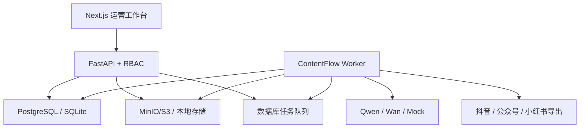

# ContentFlow 系统架构

## 1. 设计目标

内容营销同时包含概率性 AI 任务和确定性业务规则。ContentFlow 不使用一个 Agent 包办所有步骤，而是把系统拆成可观察、可重试、可替换的工作流节点。每个节点都有结构化输入输出，外部副作用只能发生在人工审核之后。

## 2. 领域模型

- `Workspace` 与 `Membership`：租户隔离和角色权限
- `Campaign`：营销目标、用户、平台、语气、必含信息和禁用表达
- `KnowledgeDocument` / `KnowledgeChunk`：知识来源、切块、向量与引用
- `WorkflowRun`：一次生成批次与各阶段状态
- `ContentItem`：平台内容、结构化排版/镜头脚本、版本、规则结果和人工审核记录
- `Asset`：图片、视频或离线分镜，关联内容版本
- `ChannelConnection`：加密平台凭据与非敏感配置
- `PublishJob`：定时发布、内容版本、外部 ID 和响应摘要
- `MetricSnapshot`：同一发布任务的分时指标快照
- `Job`：异步任务、幂等键、租约、重试与错误
- `AuditLog`：操作者、动作、实体和脱敏元数据

所有业务查询都带 `workspace_id`，API 不接受客户端自行指定工作区。用户可创建多个工作区，并通过服务端校验成员关系后换取目标工作区令牌；管理员可管理成员角色，系统阻止移除自己或降级最后一名管理员。

## 3. RAG 与向量检索

上传文件先写入对象存储，再由 `knowledge.index` Worker 读取、解码、切块和向量化。

- SQLite/离线验收：向量保存在 JSON 字段，应用内计算余弦相似度。
- PostgreSQL：初始迁移创建 `vector(1024)` 的 `knowledge_vectors` 表和 HNSW 余弦索引；查询使用 `<=>` 完成近邻检索。
- Provider：Hash Embedding 用于可复现测试；OpenAI 兼容与百炼 Provider 用于生产。

生成结果保存引用的 `source_chunk_ids`，让审核人员能够追踪内容使用了哪些知识块。

## 4. 工作流与审核门禁

`workflow.execute` 按以下阶段运行：

1. 加载并校验 Campaign
2. 检索工作区知识
3. 生成跨平台内容计划
4. 针对各平台生成文案
5. 执行禁用词、必含事实、CTA 和长度规则
6. 规则失败时自动修复一次
7. 保存内容与计划素材，状态进入 `needs_review`

小红书的卡片结构、抖音的逐镜头脚本和公众号的章节结构保存在 `layout_json`，并与正文一起写入每条 `ContentRevision`。抖音分镜会进入视频素材任务，小红书排版结构会进入人工投放包。

审核通过后才会为 `Asset` 入队；编辑内容会增加版本号、清空批准人、把旧素材标记为 `stale` 并创建新素材计划。发布 Worker 再检查：

- 内容仍是 `approved`
- 内容版本等于排期时版本
- 所有关联素材均为 `ready`
- 渠道平台与内容平台一致

这些检查防止“审核后偷偷修改”或“素材未完成就发布”。

## 5. 任务队列

项目使用数据库任务队列，避免为了展示而强制依赖 Redis/Celery。

- `idempotency_key` 防止重复入队
- Worker claim 使用租约；PostgreSQL 使用 `FOR UPDATE SKIP LOCKED`
- 进程退出后，超时租约可被其他 Worker 重新领取
- 失败任务采用指数退避，并限制最大尝试次数
- 外部异步视频任务使用 `asset.poll`，未完成不会被标成业务失败
- 最终失败会回写 Workflow、Document、Asset、PublishJob 或 Connector 状态

## 6. 存储

`ObjectStorage` 对外只有安全文件名、写入和有限大小读取：

- `LocalObjectStorage`：开发环境；路径必须位于配置根目录
- `S3ObjectStorage`：生产环境；支持 MinIO 与兼容 S3 服务

知识文件限制 20MB，模型生成素材下载限制 100MB。下载接口先校验工作区权限，再代理返回本地或 S3 对象。

## 7. 安全

- 密码使用 PBKDF2-SHA256 和独立随机 salt
- 访问令牌采用规范 Base64URL + HMAC-SHA256 签名并验证过期时间
- 平台凭据使用由应用密钥派生的 Fernet key 加密
- API 响应不返回凭据密文
- 审计元数据递归脱敏 token、secret、password 等字段
- 生产环境禁止默认应用密钥
- 平台发布必须经过 reviewer 角色和人工审核状态

大规模生产环境应继续接入企业 SSO、集中密钥管理、API 网关限流和可观测平台。

## 8. 前端

运营工作台覆盖总览、活动、审核/全量内容库、素材、发布、知识库、平台连接、数据复盘、任务队列以及团队与审计。活动页可维护结构化 Brief、启动生成、归档与恢复；审核页同时展示规则结果、已通过内容和每次模型生成/人工修改的版本历史；发布页支持排期取消；复盘页支持平台自动回收或人工录入已核对指标。顶部可切换已授权工作区，管理页可创建隔离工作区、调整成员角色并查看脱敏审计记录。各业务页依据 `viewer/editor/reviewer/admin` 隐藏或禁用越权操作，而不是等接口返回 403 后才提示。界面采用高密度、方形、单一蓝色交互色的企业应用设计；移动端把侧边栏重组为横向 section switcher，数据表转为带字段标签的记录卡。

前端不保存平台凭据，只保存当前 API 地址和访问令牌。所有关键操作都有 busy/error/success 状态。
